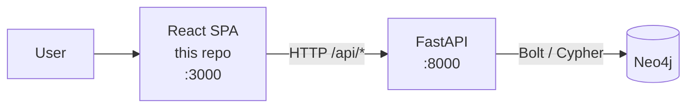

# SkyGraph — Frontend

React single-page application for **SkyGraph**, a system that finds the optimal
flight route between two airports.

Part of the SkyGraph system:

| Repository                                                                  | Role                          |
| --------------------------------------------------------------------------- | ----------------------------- |
| **SkyGraph-frontend** (this repo)                                           | React single-page application |
| [SkyGraph-backend](https://github.com/ProjetoIntegrador3b/SkyGraph-backend) | FastAPI REST API + Neo4j      |

---

## What the system does

The user picks an **origin** and a **destination** airport. The backend searches a
graph of airports and flights and returns the _optimal_ route — scored against
several weights rather than distance alone:

- **Price** — total ticket cost across all legs
- **Number of connections** — fewer stops is generally preferable
- **Total time** — flight duration plus layovers

Airports are stored as nodes and flights as relationships in a Neo4j graph
database, which is what makes this a traversal problem rather than a table join.
The architecture is documented in the
[backend README](https://github.com/ProjetoIntegrador3b/SkyGraph-backend#architecture).

### Where this app fits



This repository owns the user interface only: route search input, results
presentation, and client-side navigation. All routing logic and data live behind
the API.

> **Current state:** the app is an intentionally minimal base. It renders a single
> `/home` page while the route-search UI is designed.

---

## Tech stack

| Concern    | Choice                     | Notes                                            |
| ---------- | -------------------------- | ------------------------------------------------ |
| Framework  | React 19                   |                                                  |
| Language   | TypeScript 5.9             | Strict mode                                      |
| Build tool | Vite 7                     | Dev server and production bundler                |
| Routing    | React Router 7             | Client-side routing                              |
| Tests      | Vitest 3 + Testing Library | jsdom environment                                |
| Lint       | ESLint 9                   | Flat config, typescript-eslint                   |
| Format     | Prettier 3                 |                                                  |
| Container  | Docker + nginx             | Multi-stage build, static assets served by nginx |

---

## Getting started

```bash
npm install
npm run dev
```

The app is served at **http://localhost:5173**, and `/` redirects to `/home`.

### Available scripts

| Command                | What it does                                     |
| ---------------------- | ------------------------------------------------ |
| `npm run dev`          | Start the Vite dev server with hot reload        |
| `npm run build`        | Type-check and build for production into `dist/` |
| `npm run preview`      | Serve the production build locally               |
| `npm test`             | Run the test suite once                          |
| `npm run test:watch`   | Run tests in watch mode                          |
| `npm run lint`         | Lint with ESLint                                 |
| `npm run typecheck`    | Type-check without emitting                      |
| `npm run format`       | Format all files with Prettier                   |
| `npm run format:check` | Verify formatting without writing                |

---

## Running with Docker

The network is shared with the backend stack, so create it once:

```bash
docker network create skygraph-network
docker compose up -d --build
```

The app is served at **http://localhost:3000**.

The image is a two-stage build: Node compiles the bundle, then nginx serves the
static output — no Node runtime or `node_modules` ship in the final image.

nginx is configured with a single-page-app fallback (`try_files … /index.html`),
which is what allows a hard refresh on `/home` to work instead of returning 404.

To run the whole system, bring up the backend stack as well — both attach to the
same `skygraph-network`.

---

## Project structure

```
src/
├── App.tsx           # Router and route definitions
├── main.tsx          # React root
├── index.css         # Global styles
├── pages/            # One component per route
│   └── Home.tsx
└── test/
    └── setup.ts      # Testing Library setup, runs before each suite
```

Adding a page means creating a component in `src/pages/` and registering a
`<Route>` in `src/App.tsx`.

---

## Testing

Tests live next to the code they cover as `*.test.tsx` and run in a jsdom
environment through Vitest, which reuses the existing Vite config — there is no
separate test build pipeline.

```bash
npm test
```

---

## Continuous integration

`.github/workflows/ci.yml` runs on every pull request to `main`:

| Check               | Blocks merge?                                              |
| ------------------- | ---------------------------------------------------------- |
| `prettier --check`  | **No** — warns only, annotating the files                  |
| `eslint`            | **Yes**                                                    |
| `tsc` type-check    | **Yes**                                                    |
| `vitest`            | **Yes**                                                    |
| production build    | **Yes**                                                    |
| Docker image builds | **Yes** — builds the image and smoke-tests `/` and `/home` |

Formatting is intentionally advisory: it reports unformatted files as PR
annotations, but never blocks the merge.

`main` is protected — changes land through a pull request with the required checks
passing.
